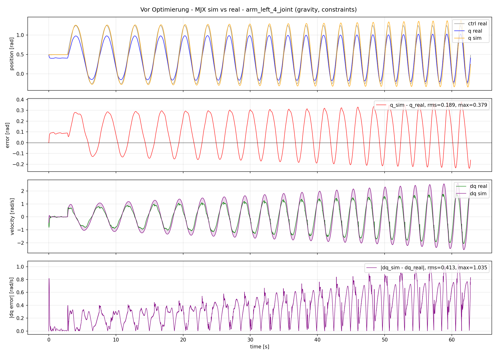

# Kangaroo SysID Scripts

Diese Skripte implementieren eine gradientenbasierte System-Identifikation (SysID)
für den Kangaroo-Arm mit MuJoCo MJX als differenzierbarem Simulator.

## Methode: Gradient-Based System Identification

### Problemformulierung

Sei $\theta \in \mathbb{R}^d$ ein Vektor physikalischer Parameter
(z.B. `armature`, `damping`, `frictionloss` eines Armgelenks).

Das **reale System** entwickelt sich nach unbekannter Dynamik:

$$s_{i+1}^r = \Phi_{\text{real}}(s_i^r,\, a_i^r;\, \theta^*)$$

Der **Simulator** approximiert diese Dynamik differenzierbar:

$$s_{i+1} = \Phi_{\text{sim}}(s_i^r,\, a_i^r;\, \theta)$$

wobei $s_i$ der Systemzustand $(q, \dot{q})$, $a_i^r$ die aufgezeichneten realen
Steuerbefehle und $\theta^*$ die unbekannten wahren Parameter sind.

Gegeben eine reale Trajektorie $\tau^r = \{s_0^r, a_0^r, \ldots, s_N^r\}$ ist
das Ziel, $\theta$ so zu schätzen, dass die simulierte Trajektorie
$\tau^s(\theta) = \{s_0^s, \ldots, s_N^s\}$ mit $s_0^s = s_0^r$ die reale
Trajektorie möglichst genau nachbildet.

### Loss-Funktion

Es wird ein **q-only MSE Loss** über zufällige Trajektorienfragmente verwendet.
Pro Iteration werden $B$ zufällige Startpunkte gezogen. Jedes Fragment der Länge
$H$ wird mit realem Anfangszustand initialisiert und mit den realen
Steuerbefehlen in MJX abgespielt:

$$\mathcal{L}(\theta) = \frac{1}{B \cdot H} \sum_{b=1}^{B} \sum_{i=0}^{H-1}
\left( q_{\text{sim},\,i+1}^{(b)}(\theta) - q_{\text{real},\,i+1}^{(b)} \right)^2$$

mit:
- $B$ — Batch-Größe (zufällige Startpunkte)
- $H$ — Horizont (Fragmentlänge in Schritten)
- $q_{\text{sim}}$ — simulierte Gelenkposition nach einem MJX-Schritt
- $q_{\text{real}}$ — aufgezeichnete reale Gelenkposition im nächsten Schritt

### Log-Parametrisierung

Da alle Parameter physikalisch positiv sein müssen, wird in Log-Space optimiert:

$$\varphi = \log(\theta), \quad \theta = \exp(\varphi)$$

Der Gradient $\frac{\partial \mathcal{L}}{\partial \varphi}$ wird mit
**Forward-Mode Automatic Differentiation** berechnet (`jax.jacfwd`), da
Reverse-Mode bei MJX-Constraints (interner `while_loop`) problematisch ist.

Die Optimierung erfolgt mit **Adam** auf $\varphi$.

### Gradienten: Forward-Mode vs. Reverse-Mode

MJX löst Constraints intern mit einem iterativen Solver (`while_loop`).
`jax.grad` (Reverse-Mode) kann durch solche Schleifen nicht stabil
differenzieren. `jax.jacfwd` (Forward-Mode) propagiert Tangenten vorwärts
und umgeht dieses Problem. Für wenige Parameter ($d = 3$) ist Forward-Mode
effizient genug.

## Datensatzformat

Die Skripte in diesem Ordner erwarten eine bereits konvertierte SysID-NPZ,
nicht die rohe ROS-NPZ.

Die Kangaroo-Datasets liegen auch lokal in diesem Ordner:

```text
scripts/Kangaroo/datasets/
```

Rohdaten zuerst konvertieren:

```bash
python scripts/Kangaroo/convert_kangaroo_real_npz.py \
  scripts/Kangaroo/datasets/DEINE_REAL_AUFNAHME.npz
```

Danach die erzeugte Datei verwenden:

```text
DEINE_REAL_AUFNAHME_sysid.npz
```

Die SysID-NPZ muss diese Keys enthalten:

```text
time
dt
ctrl
qpos
qvel
```

Erwartete Shapes:

```text
time: (T,)
dt:   scalar
ctrl: (T, 28)
qpos: (T, 39)
qvel: (T, 38)
```

Für die Arm-Joints werden `ctrl`, `qpos` und `qvel` Indizes automatisch aus dem
XML bestimmt. Manuelle Index-Listen sind im Workflow nicht nötig.

Nützliche Daten- und Plot-Skripte liegen ebenfalls in diesem Ordner:

```bash
# Rohe ROS-NPZ prüfen
python scripts/Kangaroo/plot_kangaroo_real_npz.py \
  scripts/Kangaroo/datasets/DEINE_REAL_AUFNAHME.npz \
  --all-arm-joints \
  --arm-side both \
  --split-joints

# ROS-NPZ in SysID-NPZ konvertieren
python scripts/Kangaroo/convert_kangaroo_real_npz.py \
  scripts/Kangaroo/datasets/DEINE_REAL_AUFNAHME.npz

# Konvertierte SysID-NPZ prüfen
python scripts/Kangaroo/plot_kangaroo_sysid_npz.py \
  scripts/Kangaroo/datasets/DEINE_REAL_AUFNAHME_sysid.npz \
  --all-arm-joints \
  --arm-side both \
  --split-joints

# Vor Optimierung: Sim-vs-Real plotten
python scripts/Kangaroo/plot_kangaroo_sim_vs_real.py \
  scripts/Kangaroo/datasets/DEINE_REAL_AUFNAHME_sysid.npz \
  --all-arm-joints \
  --arm-side both \
  --split-joints
```

Mit `--split-joints` wird pro Armgelenk eine eigene PNG-Datei gespeichert.
Die Plot-Ausgabe ist fest codiert:

```text
scripts/Kangaroo/datasets/plots_raw/
scripts/Kangaroo/datasets/plots_sysid/
scripts/Kangaroo/datasets/plots_sim_vs_real/
```

## Aktueller Workflow

### 1. Rohdaten prüfen

```bash
python scripts/Kangaroo/plot_kangaroo_real_npz.py \
  scripts/Kangaroo/datasets/Arms.npz \
  --all-arm-joints \
  --arm-side both \
  --split-joints
```

### 2. ROS-NPZ in SysID-NPZ konvertieren

```bash
python scripts/Kangaroo/convert_kangaroo_real_npz.py \
  scripts/Kangaroo/datasets/Arms.npz
```

### 3. Konvertierte SysID-NPZ prüfen

```bash
python scripts/Kangaroo/plot_kangaroo_sysid_npz.py \
  scripts/Kangaroo/datasets/Arms_sysid.npz \
  --all-arm-joints \
  --arm-side both \
  --split-joints
```

### 4. Vor Optimierung: MJX-vs-Real plotten

```bash
python scripts/Kangaroo/plot_kangaroo_sim_vs_real.py \
  scripts/Kangaroo/datasets/Arms_sysid.npz \
  --all-arm-joints \
  --arm-side both \
  --split-joints
```

Die Plots werden automatisch in den festen Unterordnern gespeichert, z.B.:

```text
plots_raw/Arms.arm_left_1_joint.topics.png
plots_sysid/Arms_sysid.arm_left_1_joint.sysid.png
plots_sim_vs_real/Arms_sysid.arm_left_1_joint.sim_vs_real.png
```

### 5. Parameter optimieren

`optimize_joint_params.py` nutzt Paper-nahe Trajektorien-Fragmente:

```text
pro Iteration:
  B zufällige Startpunkte aus der realen Trajektorie ziehen
  jedes Fragment mit qpos_real[start], qvel_real[start] initialisieren
  reale ctrl[start:start+horizon] in MJX abspielen
  q_sim_after_step mit q_real_next vergleichen
  q-only Loss über alle Fragmente mitteln
```

Zusätzlich wird ein fester Eval-Batch einmal am Anfang gezogen. Deshalb ist
`train` in der Ausgabe verrauscht, aber `eval` ist vergleichbar:

```text
train = aktueller zufälliger Batch
eval  = immer derselbe feste Eval-Batch
```

Alle aktuell im Skript aktivierten Parameter für beide Arme optimieren:

```bash
python scripts/Kangaroo/optimize_joint_params.py \
  --npz scripts/Kangaroo/datasets/Arms_sysid.npz \
  --horizon 100 \
  --batch-size 16 \
  --eval-batch-size 16 \
  --max-iter 300 \
  --lr 0.002
```

Der Loss mittelt dann über alle 14 Arm-Joints:

```text
arm_left_1_joint  ... arm_left_7_joint
arm_right_1_joint ... arm_right_7_joint
```

Für jeden dieser Joints bekommt jeder aktivierte Parameter einen eigenen
optimierbaren Wert.

Aktuell aktivierte Parameter in `optimize_joint_params.py`:

```python
ACTUATOR_PARAM_NAMES = ("armature", "damping", "frictionloss")
BODY_PARAM_NAMES = ("mass", "inertia", "ipos")
```

`damping` und `frictionloss` starten im XML teils bei `0.0`. Für die
Log-Parametrisierung setzt das Skript intern einen kleinen positiven Startwert
von `0.0001`.

### 6. Nach Optimierung plotten

Der Optimizer schreibt ein neues XML:

```text
scripts/Kangaroo/Robot/kangaroo_grippers_mjx_sysid.xml
```

Dieses XML kann direkt für den Vergleichsplot verwendet werden:

```bash
python scripts/Kangaroo/plot_kangaroo_sim_vs_real.py \
  scripts/Kangaroo/datasets/Arms_sysid.npz \
  --xml scripts/Kangaroo/Robot/kangaroo_grippers_mjx_sysid.xml \
  --all-arm-joints \
  --arm-side both \
  --split-joints
```

Der Plot wird fest in `scripts/Kangaroo/datasets/plots_sim_vs_real/`
gespeichert.

### 7. Video rendern

Nur MJX-Simulation:

```bash
python scripts/Kangaroo/render_dataset_video.py \
  --npz scripts/Kangaroo/datasets/Arms_sysid.npz \
  --mode sim \
  --start 0 \
  --stop 28512 \
  --stride 1 \
  --fps 200
```

Real links, MJX rechts:

```bash
python scripts/Kangaroo/render_dataset_video.py \
  --npz scripts/Kangaroo/datasets/Arms_sysid.npz \
  --mode sim \
  --start 0 \
  --stop 28512 \
  --stride 4 \
  --fps 50
```

## Constraints, Gravity und Base

Für reale Kangaroo-Daten laufen die Skripte standardmäßig mit Gravity,
Equality Constraints und Contacts. Dafür muss kein Argument gesetzt werden.

Das ist für Kangaroo wichtig, weil das Modell mechanische Kopplungen bzw.
Closed-Loop-Strukturen enthält. Ohne diese Constraints sieht das Modell zwar
einfacher aus, aber körperlich falsch.

Nur für Debug-Tests können Constraints/Contacts deaktiviert werden:

```bash
--disable-constraints
```

Intern werden dann deaktiviert:

```python
mjDSBL_EQUALITY
mjDSBL_CONTACT
```

Gravity kann ebenfalls nur für Debug-Tests ausgeschaltet werden:

```bash
--no-gravity
```

Die Base ist standardmäßig gepinnt. Das heißt nach jedem Simulationsschritt
werden Floating-Base-Position, Orientierung und Geschwindigkeit wieder fixiert.
Mit `--free-base` kann dieses Verhalten ausgeschaltet werden.

Aktueller Standard für echte Arm-Daten:

```text
gravity:      on      (Default)
constraints:  on      (Default)
base:         pinned  (kein --free-base)
```

## Warum Forward-Mode?

MJX kann mit Constraints forward simulieren. Reverse-Mode Backpropagation
(`jax.value_and_grad`) ist bei Constraints aber problematisch, weil der interne
MJX-Solver einen `while_loop` verwenden kann. Deshalb nutzen die Kangaroo-Skripte
für Gradienten aktuell Forward-Mode:

```python
jax.jacfwd(loss_fn)
```

Das ist für wenige Parameter wie `armature`, `damping` und `frictionloss`
praktisch und robust genug.

## Aktuelle Skripte

```text
convert_kangaroo_real_npz.py
plot_kangaroo_real_npz.py
plot_kangaroo_sysid_npz.py
plot_kangaroo_sim_vs_real.py
```

Konvertieren und Prüfen der realen Kangaroo-Daten.

```text
optimize_joint_params.py
```

Optimiert alle oben im Skript aktivierten Parameter für alle 14 Arm-Joints mit
Adam auf einem q-only Loss über zufällige Trajektorien-Fragmente.

```text
render_dataset_video.py
```

Rendert ein Video aus realem Dataset-Playback und/oder MJX-Rollout.

## Beispiel-Output

### Sim-vs-Real Plot



### Arms Real-vs-Sim Animation


[MP4 öffnen](datasets/Arms_sysid.mjx_real_vs_sim.mp4)
