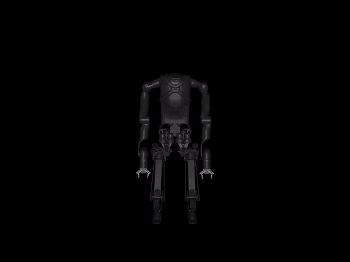

# Kangaroo SysID Scripts

Diese Skripte bauen die Kangaroo-SysID-Pipeline schrittweise neu auf.

## Datensatzformat

Die Skripte in diesem Ordner erwarten eine bereits konvertierte SysID-NPZ,
nicht die rohe ROS-NPZ.

Die Kangaroo-Datasets liegen auch lokal in diesem Ordner:

```text
scripts/Kangaroo/datasets/
```

Rohdaten zuerst konvertieren:

```bash
python scripts/Kangaroo/convert_kangaroo_real_npz.py \
  scripts/Kangaroo/datasets/DEINE_REAL_AUFNAHME.npz
```

Danach die erzeugte Datei verwenden:

```text
DEINE_REAL_AUFNAHME_sysid.npz
```

Die SysID-NPZ muss diese Keys enthalten:

```text
time
dt
ctrl
qpos
qvel
```

Erwartete Shapes:

```text
time: (T,)
dt:   scalar
ctrl: (T, 28)
qpos: (T, 39)
qvel: (T, 38)
```

Für `arm_left_4_joint` werden aktuell diese Indizes verwendet:

```text
ctrl[:, 19] -> Command
qpos[:, 12] -> Position q
qvel[:, 11] -> Geschwindigkeit dq
```

Nützliche Daten- und Plot-Skripte liegen ebenfalls in diesem Ordner:

```bash
# Rohe ROS-NPZ prüfen
python scripts/Kangaroo/plot_kangaroo_real_npz.py \
  scripts/Kangaroo/datasets/DEINE_REAL_AUFNAHME.npz

# ROS-NPZ in SysID-NPZ konvertieren
python scripts/Kangaroo/convert_kangaroo_real_npz.py \
  scripts/Kangaroo/datasets/DEINE_REAL_AUFNAHME.npz

# Konvertierte SysID-NPZ prüfen
python scripts/Kangaroo/plot_kangaroo_sysid_npz.py \
  scripts/Kangaroo/datasets/DEINE_REAL_AUFNAHME_sysid.npz

# Vor Optimierung: Sim-vs-Real plotten
python scripts/Kangaroo/plot_kangaroo_sim_vs_real.py \
  scripts/Kangaroo/datasets/DEINE_REAL_AUFNAHME_sysid.npz
```

## Aktueller Workflow

### 1. Rohdaten prüfen

```bash
python scripts/Kangaroo/plot_kangaroo_real_npz.py \
  scripts/Kangaroo/datasets/left_elbow_chirp_20260530_081011.npz
```

### 2. ROS-NPZ in SysID-NPZ konvertieren

```bash
python scripts/Kangaroo/convert_kangaroo_real_npz.py \
  scripts/Kangaroo/datasets/left_elbow_chirp_20260530_081011.npz
```

### 3. Konvertierte SysID-NPZ prüfen

```bash
python scripts/Kangaroo/plot_kangaroo_sysid_npz.py \
  scripts/Kangaroo/datasets/left_elbow_chirp_20260530_081011_sysid.npz
```

### 4. Vor Optimierung: MJX-vs-Real plotten

```bash
python scripts/Kangaroo/plot_kangaroo_sim_vs_real.py \
  scripts/Kangaroo/datasets/left_elbow_chirp_20260530_081011_sysid.npz
```

Der Plot wird automatisch in `scripts/Kangaroo/datasets/` gespeichert.

### 5. Parameter optimieren

`03_optimize_q.py` nutzt Paper-nahe Trajektorien-Fragmente:

```text
pro Iteration:
  B zufällige Startpunkte aus der realen Trajektorie ziehen
  jedes Fragment mit qpos_real[start], qvel_real[start] initialisieren
  reale ctrl[start:start+horizon] in MJX abspielen
  q_sim_after_step mit q_real_next vergleichen
  q-only Loss über alle Fragmente mitteln
```

Zusätzlich wird ein fester Eval-Batch einmal am Anfang gezogen. Deshalb ist
`train` in der Ausgabe verrauscht, aber `eval` ist vergleichbar:

```text
train = aktueller zufälliger Batch
eval  = immer derselbe feste Eval-Batch
```

Alle drei aktuellen Parameter optimieren:

```bash
python scripts/Kangaroo/03_optimize_q.py \
  --npz scripts/Kangaroo/datasets/left_elbow_chirp_20260530_081011_sysid.npz \
  --horizon 100 \
  --batch-size 16 \
  --eval-batch-size 16 \
  --max-iter 300 \
  --lr 0.002 \
  --armature 0.00663065 \
  --damping 0.0001 \
  --frictionloss 0.0001 \
  --optimize armature damping frictionloss
```

Wichtig: `damping` und `frictionloss` starten im XML bei `0.0`. Für die
Log-Parametrisierung ist ein kleiner positiver Startwert wie `0.0001`
praktischer.

### 6. Nach Optimierung plotten

Die besten Werte aus der Ausgabe in den Plot übernehmen:

```bash
python scripts/Kangaroo/plot_kangaroo_sim_vs_real.py \
  scripts/Kangaroo/datasets/left_elbow_chirp_20260530_081011_sysid.npz \
  --armature 0.00394267 \
  --damping 0.00014238 \
  --frictionloss 0.00010000 \
  --out scripts/Kangaroo/datasets/left_elbow_chirp_optimized_sim_vs_real.png
```

### 7. Video rendern

Nur MJX-Simulation:

```bash
python scripts/Kangaroo/04_render_mjx_dataset_video.py \
  --npz scripts/Kangaroo/datasets/left_elbow_chirp_20260530_081011_sysid.npz \
  --mode sim \
  --start 0 \
  --stop 12560 \
  --stride 4 \
  --fps 50
```

Real links, MJX rechts:

```bash
python scripts/Kangaroo/04_render_mjx_dataset_video.py \
  --npz scripts/Kangaroo/datasets/left_elbow_chirp_20260530_081011_sysid.npz \
  --mode side-by-side \
  --start 0 \
  --stop 12560 \
  --stride 4 \
  --fps 50
```

## Constraints, Gravity und Base

Für reale Kangaroo-Daten laufen die Skripte standardmäßig mit Gravity,
Equality Constraints und Contacts. Dafür muss kein Argument gesetzt werden.

Das ist für Kangaroo wichtig, weil das Modell mechanische Kopplungen bzw.
Closed-Loop-Strukturen enthält. Ohne diese Constraints sieht das Modell zwar
einfacher aus, aber körperlich falsch.

Nur für Debug-Tests können Constraints/Contacts deaktiviert werden:

```bash
--disable-constraints
```

Intern werden dann deaktiviert:

```python
mjDSBL_EQUALITY
mjDSBL_CONTACT
```

Gravity kann ebenfalls nur für Debug-Tests ausgeschaltet werden:

```bash
--no-gravity
```

Die Base ist standardmäßig gepinnt. Das heißt nach jedem Simulationsschritt
werden Floating-Base-Position, Orientierung und Geschwindigkeit wieder fixiert.
Mit `--free-base` kann dieses Verhalten ausgeschaltet werden.

Aktueller Standard für echte Arm-Daten:

```text
gravity:      on      (Default)
constraints:  on      (Default)
base:         pinned  (kein --free-base)
```

## Warum Forward-Mode?

MJX kann mit Constraints forward simulieren. Reverse-Mode Backpropagation
(`jax.value_and_grad`) ist bei Constraints aber problematisch, weil der interne
MJX-Solver einen `while_loop` verwenden kann. Deshalb nutzen die Kangaroo-Skripte
für Gradienten aktuell Forward-Mode:

```python
jax.jacfwd(loss_fn)
```

Das ist für wenige Parameter wie `armature`, `damping` und `frictionloss`
praktisch und robust genug.

## Aktuelle Skripte

```text
convert_kangaroo_real_npz.py
plot_kangaroo_real_npz.py
plot_kangaroo_sysid_npz.py
plot_kangaroo_sim_vs_real.py
```

Konvertieren und Prüfen der realen Kangaroo-Daten.

```text
01_rollout_fixed_params.py
```

Lädt XML und SysID-NPZ, setzt feste Parameter und spielt reale `ctrl`-Commands
in MJX ab. Gibt `q_sim` vs. `q_real` Diagnosewerte aus.

```text
02_loss_grad_q.py
```

Berechnet einen q-only Loss und Forward-Mode-Gradienten nach
`armature`, `damping` und `frictionloss`.

```text
03_optimize_q.py
```

Optimiert ausgewählte Parameter mit Adam auf einem q-only Loss.

```text
04_render_mjx_dataset_video.py
```

Rendert ein Video aus realem Dataset-Playback und/oder MJX-Rollout.

## Beispiel-Output

### Sim-vs-Real Plot


### MJX Animation



[MP4 öffnen](datasets/left_elbow_chirp_mjx_sim.mp4)
